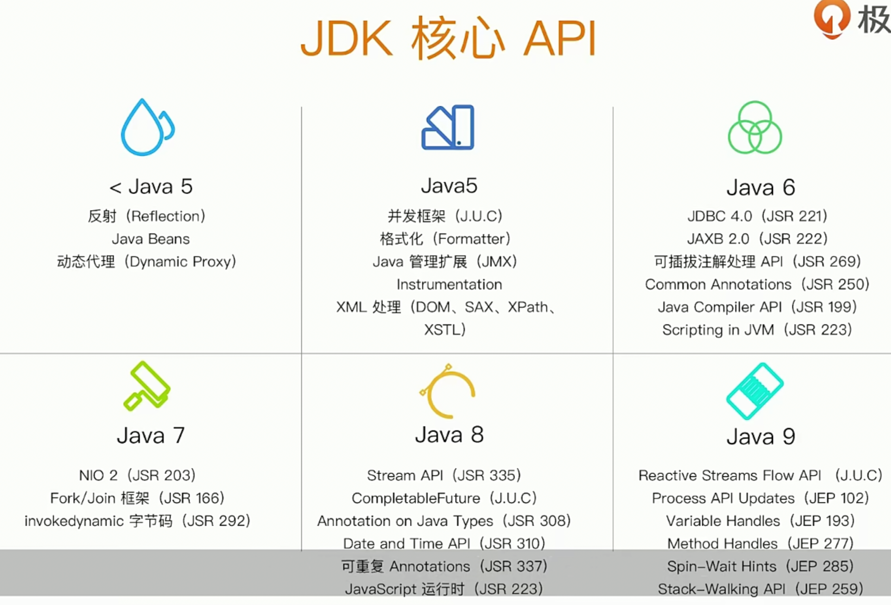
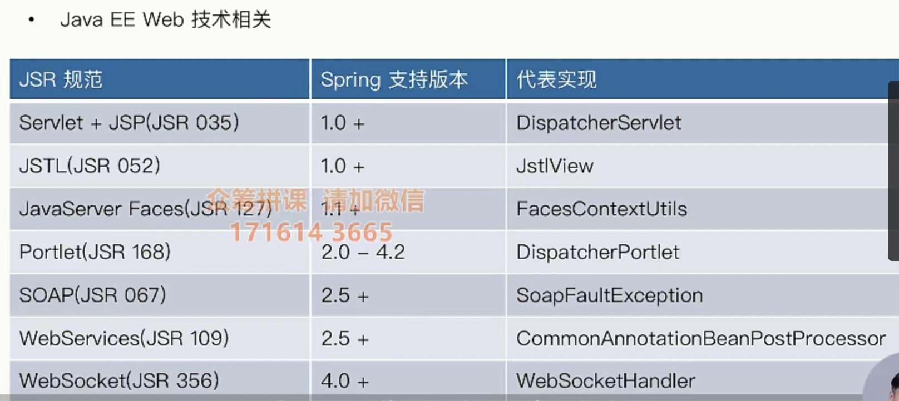
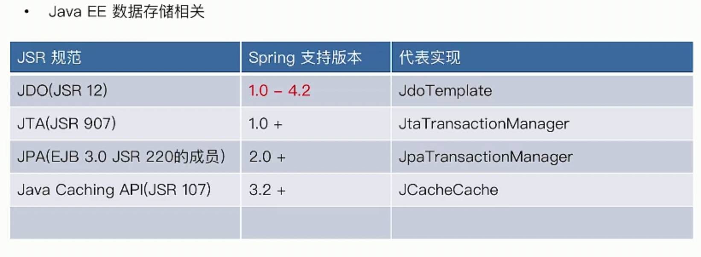
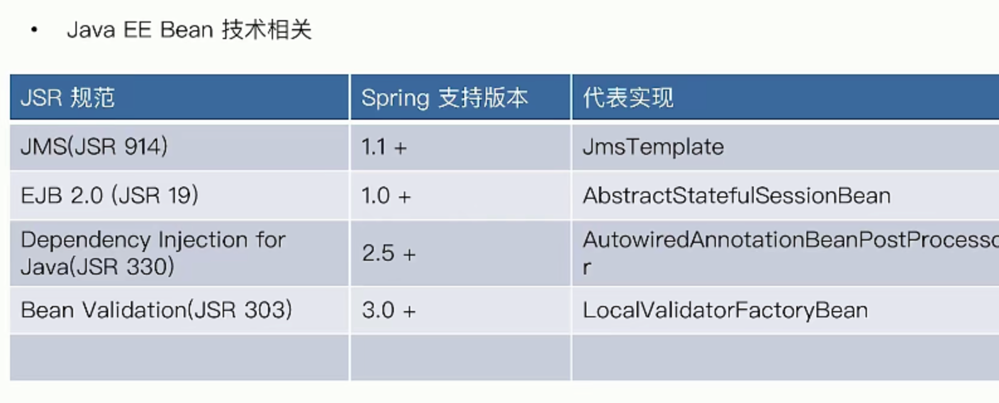
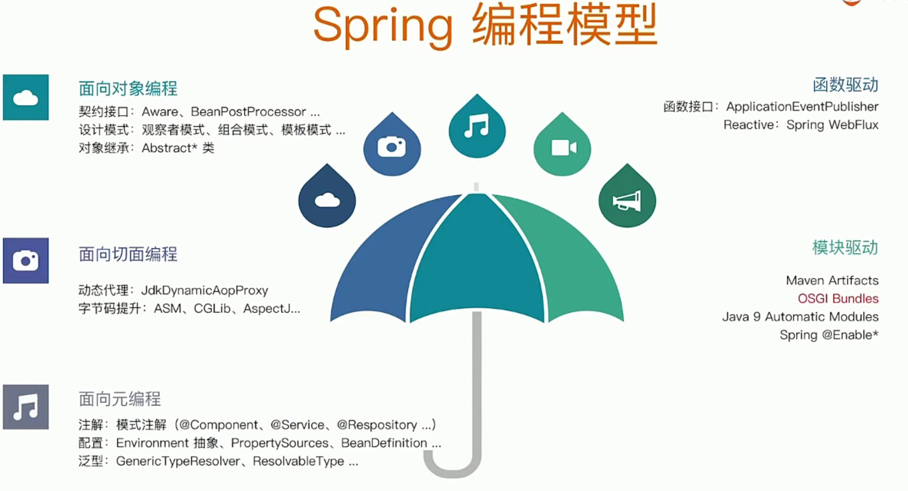

# spring特性

​	特性概览

## spring对Java核心API的使用和提升

- 反射：MethodMatcher
- Java Bean：CachedIntrosperctionResults
- 动态代理：JdkDynamicAopProxy  
- XML处理：XmlBeanDefinitionReader
- Java管理扩展：@ManagedResource
- Instrumentation：InstrumentationSavingAgent，本地存储字节码做字节码提升
- JUC：ThreadPoolTaskScheduler
- 格式化：Formatter：DateFormatter
- JDBC：JdbcTemplate
- Common Annotations（jsr250)：CommonAnnotationBeanPostProcessor 。通用注解规范，包括一些Bean生命周期的注解，权限注解等。
- JAXB：Jaxb2Marshaller，xml绑定
- Scripting in JVM：StandardScriptFactory
- 可拔插注解处理API JSR 269: @Indexed。
  在JSR 269 之前可以使用注解，但必须借助反射机制，而反射的方法局限性较大，由于必须定义@Retention为RetentionPolicy.RUNTIME，只能在运行期通过反射来获取注解值，使得运行时代码效率降低。其次，如果想在编译阶段利用注解来进行一些检查，对用户的某些不合理代码给出错误报告，反射的使用方法就无能为力了。而 JSR 269 之后我们可以在 Javac的编译期利用注解做这些事情。所以我们发现核心的区分是在运行期 or 编译期。
- Java Compiler API：TestCompiler。和apt相关，在测试的时候，如果需要用注解来进行一些检查，这些检查也需要编译，需要指定编译器。
- Fork/Join：ForkJosinPoolFactoryBean
- NIO 2：PathResource，路径是路径，文件是文件。
- Date a n d Time API：DateTimeContext
- 可重复Annotations：@PropertySources。
- Stream API：StreamConverter
- CompletableFuture：CompletableToListenableFutureAdapter，guava的实现的一个适配器。

## Spring对Java EE API的整合

## Spring所用到的编程模型

## Spring Framework有哪些核心模块

- spring-core：Spring基础API模块，如资源管理，范型处理
- spring-beans：Spring Bean相关，如依赖查找（BeanFactory#get()），依赖注入（@Au towired）
- spring-aop：SpringAOP处理，如动态代理，AOP字节码提升
- spring-context：事件驱动（ApplicationEvent），注解驱动（Component），模块驱动（@Enable）

# IOC容器

## IOC容器的职责

- 通用职责
  - 依赖处理
    - 依赖查找
    - 依赖注入
  - 生命周期管理
    - 容器
    - 托管的资源（Java Beans或其他资源）
  - 配置
    - 容器
    - 外部化配置
    - 托管的资源（Java Bean或其他资源）

## IOC容器的实现

- Java SE
  - Java Beans
  - Java ServiceLoader SPI
  - JNDI(Java Naming and Directory Interface)
- Java EE
  - EJB(Enterprise Java Beans)
  - Servlet
- 开源
  - Apache Avalon
  - PicoContainer
  - Google Guice
  - Spring Framework

## Java Beans的实现

### 特性

- 依赖查找
- 生命周期管理
- 配置元信息
- 事件
- 自定义
- 资源管理
- 持久化

# ioc容器

## 构造器注入 和 Setter注入的比较

构造器注入（Spring官方现在推荐的方式）

- 在对象初始化的时候就完成依赖注入
- 需要被注入的对象都是非空的（其实可以通过ObjectProvider对可能为空的对象进行nu ll的构造器注入）
- 一般来说构造器注入形参都是final，因为构造器注入鼓励注入后不变。这样会防止很多问题。
- 构造器参数没有一个名称给外部进行内省和自省（可以通过注解来解决）
- 接口在方法的参数名字是不保留的，

Setter注入（Spring作者在without EJB的）

- 选择性构造
- 让对象变得更可配（可以多次Set），重新注入在某一时刻
- 可以使用PropertyEditor
- 对象初始化的时候可以有默认值
- set 和 get方法更加灵活可变，在方法里面进行逻辑处理
- set方法的执行顺序无法确定

## Spring IoC容器 的 依赖查找

### 根据Bean名称查找

#### 实时查找

#### 延迟查找

# 面试题

## Spring作为IoC容器有什么优势

- 典型的IoC管理，依赖查找和依赖注入
- AOP抽象
- 事务抽象
- 事件扩展机制
- SPI扩展：
  - SPI 全称为 Service Provider Interface,是一种服务发现机制。在META-INF/services下面定义个文件，然后通过一个特殊的类加载器，启动的时候去加载定义文件中的类。
  - 引入SPI机制后，服务接口与服务实现就会达成分离的状态，可以实现解耦以及程序可扩展机制
  - 服务提供者，比如springboot starter提供出SPI接口后，客户端就可以通过本地注册的形式，将实现类注册到服务端，轻松实现可插拔。
- 强大的第三方整合
- 易测试性
- 更好的面向对象
